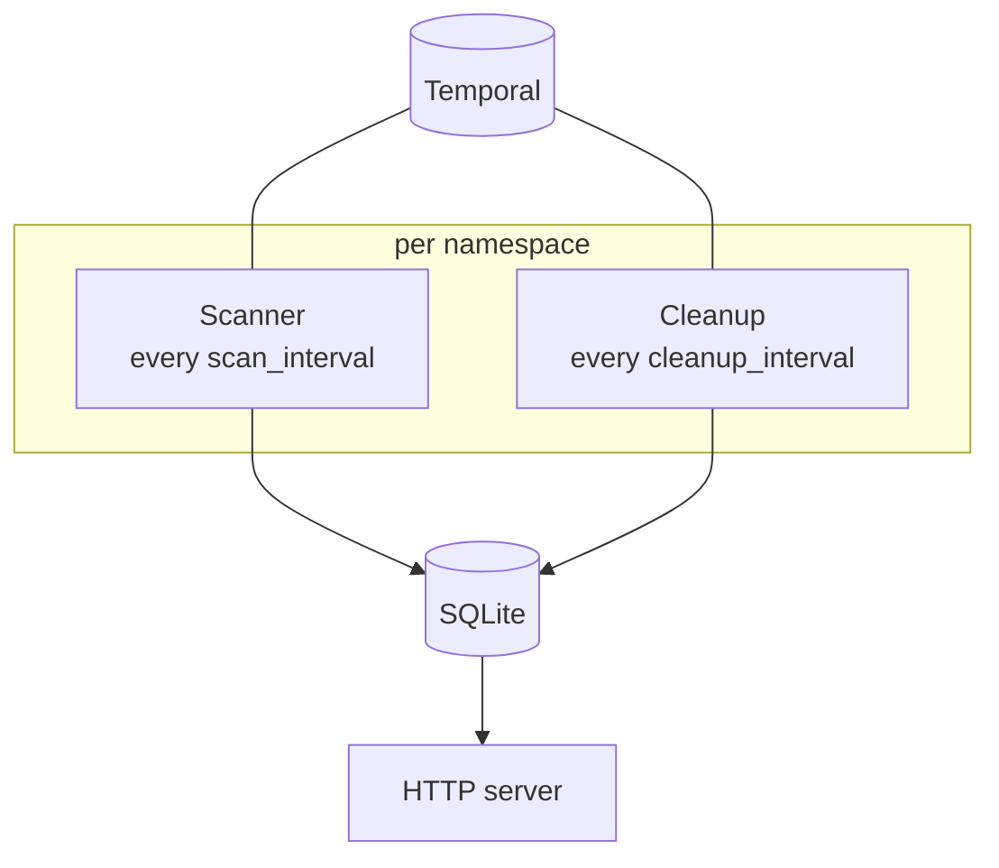

# How it works

Two-level polling, event normalization, hashing, storage, and the cleanup worker.

## Architecture

Each configured namespace gets two independent workers on their own threads. One HTTP server
serves all of them.



Workers never talk to each other; SQLite is the only shared state.

## Two-level polling

Downloading every history on every tick would defeat the purpose, so the scanner separates
*noticing a change* from *reacting to it*.

### Level 1 — list

Each tick issues one Visibility API query per namespace, using the configured
[`query`](configuration.md) (default `ExecutionStatus = 'Running'`). The response carries
metadata only: workflow ID, run ID, type, and `HistoryLength`.

For each listed workflow, the stored `history_length` is compared with the one just
reported:

- **Equal** → nothing has happened since the last scan. The workflow is skipped and no
  history is fetched. This increments `workflows_skipped_unchanged_total`.
- **Different or absent** → the workflow is new or has advanced. Continue to level 2.

That comparison is what makes a frequent scan interval affordable. In a steady state most
workflows are unchanged, and a tick costs one list call.

### Level 2 — fetch, normalize, hash

Only for workflows that changed:

1. `GetWorkflowExecutionHistory`, following pagination until the token is empty.
2. Every event is converted to a canonical token, or dropped, or rejected.
3. The tokens are joined with newlines and hashed with SHA-256.
4. The row is written with `INSERT OR REPLACE`.

If **any** event in the history fails to tokenize, the whole workflow is skipped —
`workflows_dropped_total` is incremented and the reason logged. A partial hash would be worse
than no hash: it would silently claim two different executions were identical.

## Normalization

The goal is to keep everything that reflects a decision in the workflow code and discard
everything that differs merely because this was a different run.

### Always discarded

| Dropped | Why |
| --- | --- |
| `eventId`, `eventTime`, `version`, `taskId` | Internal identifiers and timestamps |
| `runId`, `workflowId` | Unique per run by definition |
| `identity`, `attempt`, `namespace` | Worker metadata and retry counters |
| Activity timeouts and retry policy | Options, not control flow |
| All activity input and result payloads | Where `user_id`, `transaction_id`, emails live |
| `SideEffect` details | Non-deterministic by definition |
| `searchAttributes` | Operational metadata |
| `stackTrace` on terminal failures | Varies per run |

Payload data being excluded has one consequence worth knowing: if a workflow ever branches on
a value passed in a payload — a feature flag, an A/B group — two logically different
executions will collapse to the same hash.

### Tokens

| Token | Event |
| --- | --- |
| `WS:<type>` | `WorkflowExecutionStarted` |
| `A:<type>` | `ActivityTaskScheduled` |
| `AC` / `AF:<type>` / `ATO` / `ACx` | Activity completed / failed / timed out / canceled |
| `T:<seconds>` / `TF` / `TX` | Timer started (bucketed) / fired / canceled |
| `V:"<change-id>":<n>` | `MarkerRecorded`, `Version` marker — a `getVersion()` branch |
| `SE` | `MarkerRecorded`, `SideEffect` marker — presence only |
| `C:<type>` | `StartChildWorkflowExecutionInitiated` |
| `CC` / `CF:<type>` / `CTO` / `CCx` / `CTx` | Child completed / failed / timed out / canceled / terminated |
| `CSF:<cause>` | `StartChildWorkflowExecutionFailed` |
| `CR` | `WorkflowExecutionCancelRequested` |
| `S:<name>` | `WorkflowExecutionSignaled` |
| `SIG:<name>` / `SIGF` | Signal to an external workflow, initiated / failed |
| `RCE` / `RCEF` | Cancel request to an external workflow, initiated / failed |
| `U:<name>` / `UC` | Update accepted / completed |
| `DONE:success` | `WorkflowExecutionCompleted` |
| `DONE:failure:<type>` | `WorkflowExecutionFailed` |
| `DONE:canceled` / `DONE:terminated` / `DONE:timedout` / `DONE:continue-as-new` | Other terminal events |

Token order is part of the hash. Two workflows containing the same events in a different
order hash differently.

Ignored entirely — they are bookkeeping or the shadow half of an event already counted:
`WorkflowTaskScheduled`, `WorkflowTaskStarted`, `WorkflowTaskCompleted`, `WorkflowTaskFailed`,
`WorkflowTaskTimedOut`, `ActivityTaskStarted`, `ActivityTaskCancelRequested`,
`ChildWorkflowExecutionStarted`, `ExternalWorkflowExecutionSignaled`,
`ExternalWorkflowExecutionCancelRequested`, `UpsertWorkflowSearchAttributes`,
`WorkflowExecutionPaused`, `WorkflowExecutionUnpaused`, `WorkflowExecutionOptionsUpdated`,
`WorkflowPropertiesModified`, `WorkflowPropertiesModifiedExternally`,
`ActivityPropertiesModifiedExternally`, `WorkflowExecutionUpdateAdmitted`,
`WorkflowExecutionTimeSkippingTransitioned`.

Everything else — all nine Nexus event types, `WorkflowExecutionUpdateRejected`, and any event
type a future Temporal version adds — is an error, and drops the workflow. That is deliberate:
skipping a workflow is recoverable, whereas silently ignoring an unrecognised event could
merge two genuinely different code paths into one hash and hide the bug you were testing for.

### Timer buckets

Raw timeouts cluster densely — a "one month" business timer produces hundreds of distinct
second-values. Including them verbatim would make every such workflow unique. The timeout is
therefore rounded up to a bucket, and the token carries the bucket's value **in seconds**:

| Timeout | Token |
| --- | --- |
| ≤ 60s | `T:60` |
| ≤ 10m | `T:600` |
| ≤ 1h | `T:3600` |
| ≤ 1d | `T:86400` |
| ≤ 7d | `T:604800` |
| ≤ 30d | `T:2592000` |
| > 30d | `T:7776000` |

The exact duration does not affect replay: `TimerFired` is already in the history, so replay
never waits, and Temporal's determinism check matches timer *commands* by sequence rather than
by duration. Buckets are kept anyway because a large difference in duration is usually a proxy
for a different branch — `if trial { sleep(7d) } else { sleep(30d) }` — and those are genuinely
different workflows to test.

Note that everything above 30 days lands in the same bucket; there is no separate `> 90d`
category.

## Hashing

Tokens are joined with `\n` and hashed once with SHA-256, stored as lowercase hex. The
algorithm is chosen for a negligible collision probability, not for cryptographic strength.

```text
WS:OrderFulfillment
A:inventory.reserve
AC
V:"checkout-v2":1
A:payments.charge
AF:CardDeclined
T:600
TF
A:payments.charge
AC
DONE:success
```

Changing the normalization rules — the token set or the bucket boundaries — invalidates every
stored hash. There is currently **no schema-version column and no rehash command**: after such
a change, delete the database and let it repopulate.

## Storage

One SQLite file at `./data/workdup.db`, relative to the working directory and not
configurable. WAL mode, five-second busy timeout.

```sql
CREATE TABLE workflows (
    namespace      TEXT     NOT NULL,
    workflow_id    TEXT     NOT NULL,
    run_id         TEXT     NOT NULL CHECK (length(run_id) = 36),
    workflow_type  TEXT     NOT NULL CHECK (length(workflow_type) <= 200),
    history_length INTEGER  NOT NULL,
    semantic_hash  CHAR(64) NOT NULL,
    last_checked   TEXT     NOT NULL DEFAULT (datetime('now')),
    PRIMARY KEY (namespace, workflow_id, run_id)
)
```

The primary key includes `run_id` because continue-as-new gives one workflow ID several runs,
and each run is a separate history.

`/unique-workflows` is a `GROUP BY semantic_hash` over this table: one arbitrary
representative per distinct hash.

## Cleanup

Workflows that finish should leave the set — otherwise it grows forever and replay covers
executions that no longer represent anything current.

Each cleanup tick selects rows for its namespace whose `last_checked` is more than **one day**
old (hardcoded, independent of `cleanup_interval`), and for each one asks Temporal for the
current status:

| Result | Action |
| --- | --- |
| Status is not `Running` | Delete the row |
| `NOT_FOUND` | Delete the row — aged out of Temporal's retention |
| `UNAVAILABLE` or `DEADLINE_EXCEEDED` | Leave it, retry next tick |
| Any other gRPC error | Log it, leave the row |

The `last_checked` filter is what makes this cheap, and it works because of how the scanner
writes. Every upsert resets `last_checked` to now, so any workflow still matching your scan
query stays permanently fresh and is never a cleanup candidate. Only rows that have *stopped*
being returned by the scan — because the workflow completed and no longer matches
`ExecutionStatus = 'Running'` — age past the threshold and get checked.

One consequence: with a scan query that matches completed workflows too, rows never age out
and cleanup will find nothing to do.

## Known limits

- **Nexus is not supported.** Any Nexus event drops the workflow. Watch
  `workflows_dropped_total`.
- **SQLite only.** No pluggable backends; single file, single writer.
